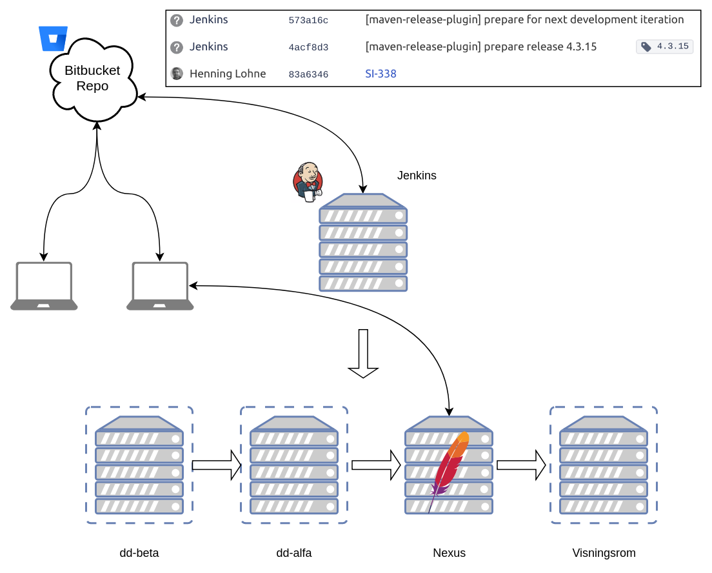
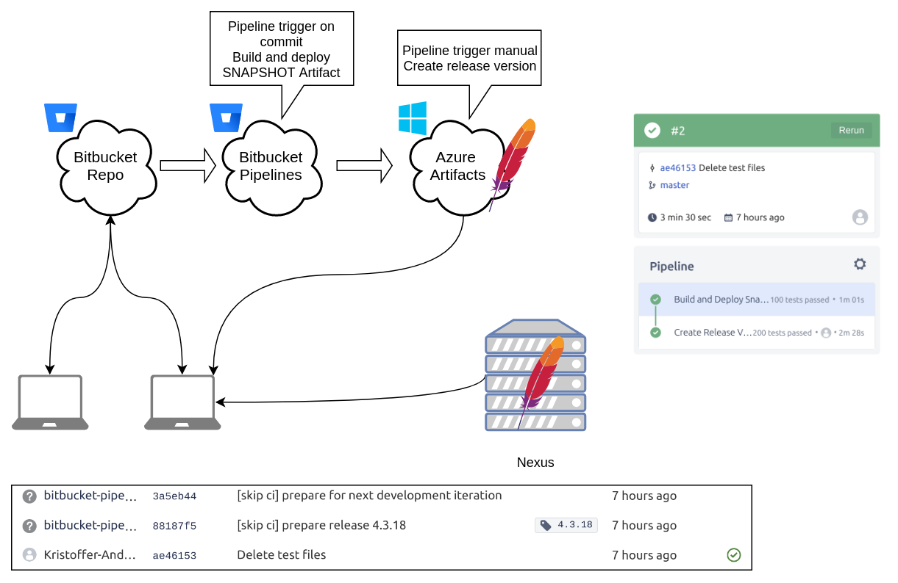
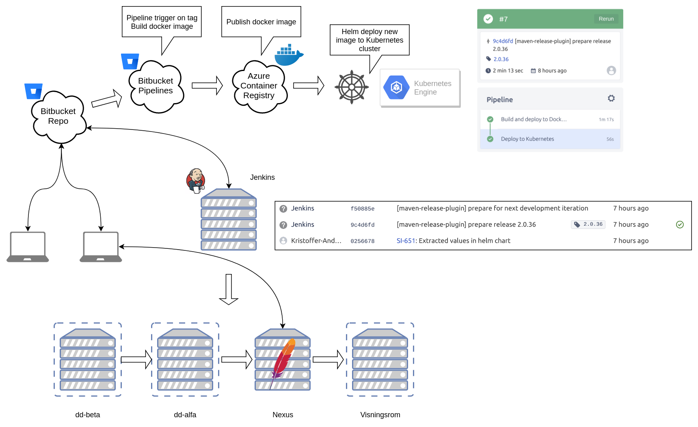
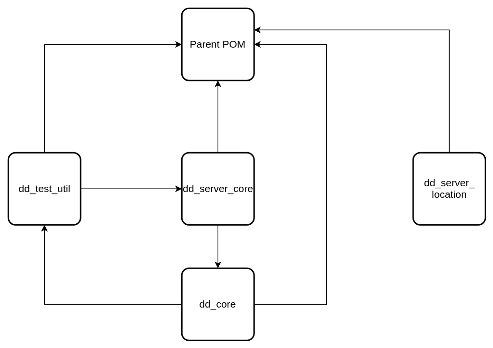
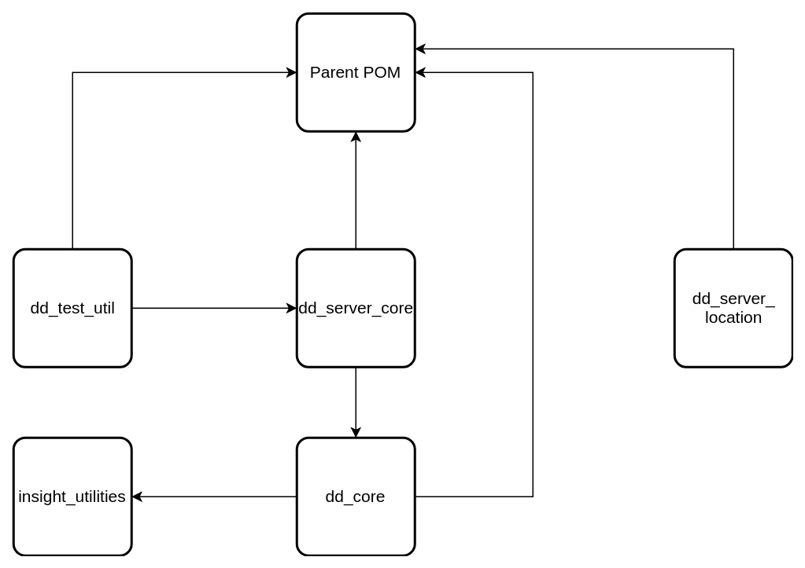
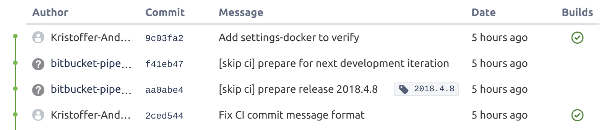

# Uke 4 - Dypt inn i skyene

::: tip Timer
Denne uken: 48

**Totalt: 141** :tada:
:::

[[toc]]

## Fredag

Jobbet i dag med å implementere DNS støtte til Kubernetes klusteret, slik at vi når ressursene i klusteret via en URL istedet for via IP adresser som kan endre seg.

Domenet som brukte tilhører egentlig Stacc Flow, men jeg kunne få sette opp en DNS oppføring som ser slik ut `*.insight.stacctest.com`,
denne DNS oppføringen inneholder ett _wildcard_ som gjør det slik vi kan enkelt ha mange miljøer opp mot dette domenet. Som for eksempel `beta.insight.stacctest.com` som da kan tilhøre vårt beta miljø.

I Kubernetes klusteret for å dra nytte av dette måtte jeg fjerne last balanseren og inføre en Ingress kontroller. En Ingress er ett objekt i Kubernetes som lar oss koble oss til Kubernetes services utenfor klusteret. Ingress kontrolleren sender oss videre til en spesifikk tjeneste basert på regler.


Jeg holdt også en presentasjon om de nye Bitbucket Pipelines, hvordan konfigurere Maven til å snakke med Azure Artifacts. Og kort om bygge prosessen mot Azure Artifacts, Azure Container Registry og Kubernetes.

Presentasjonen inneholdt diagrammene fra gårsdagens innlegg. Jeg smekket i sammen en kjapp presentasjon med hjelp av [reveal.js](https://github.com/hakimel/reveal.js/), ett HTML presentasjons rammeverk som kjører på Node.js, som jeg også da deployet til Kubernetes for å demonstrere hvor langt prosjeket har kommet.

## Torsdag

Etter floken i går kveld, fikk jeg i dag deployet alle fem bibliotekene til Azure Artifacts og Bitbucket Pipelinen fungerer.
`dd_server_location` kan også nå hente ut `paren POM` fra Azure Artifacts, så jeg kunne nå lukke ett par del-saker i Jira knyttet til prosjeket.

### Kort om bygge prosessen "the old way"

Utviklerne henter kode fra Bitbucket, kan bygge lokalt på maskinen for å teste (henter artefakter fra Nexus internt). Jenkins sjekker repoet på bitbucket med jevne mellomrom. Er det nye endringer start Jenkins bygge prosessen. Først kloner den prosjektet, bygger det, utfører API tester og deployer ut til test miljøene våre. Og lagrer alt som blir bygget i Nexus (jar-arkiver, war-arkiver, npm og Docker).



### Kort om bygge prosessen for biblioteker og parent POM

Dette er den nye pipelinen for biblioteker (jar-arkiv) og parent POM'er.

Utviklerne henter kode fra Bitbucket, og artefakter fra Azure Artifacts og evt Nexus.

Nye moduler blir nå bygget i Bitbucket Pipelines hver gang noen commiter. Byggingen bruker et spesielt docker bygg image, det blir også kjørt tester. Det blir da laget en SNAPSHOT versjon som blir lastet opp på Azure Artifacts. Når det er tid for å lage en release går man inn på Bitbucket og trykker _release_, dette er noe som kan skrues av slik at det alltid blir deployet en release. Release versjonen blir også lastet opp på Azure Artifacts.



### Kort om bygge prosessen for moduler

Samme situasjon for utvikleren som i sted. Men siden vi fremdeles vil beholde testmiljøene, og interne testingen mellom moduler, til alle modulene er deployet i Kubernetes bygges moduler på Jenkins.

Det er først når Jenkins er ferdig og har tagget git loggen at Bitbucket Pipeline blir trigget. Da blir det bygget docker image, lastet opp til Azure Container Registry og Helm vil deploye det nye imaget til Kubernetes klusteret.



## Onsdag

I dag har jeg fortsatt arbeidet med å sette opp pipelines og få deployet noen av kjerne bibliotekene våre til Azure Artifacts.
Når jeg begynner å flytte biblioteker opp i Bitbucket Pipeline og Azure Artifacts vil moduler som blir bygget på den interne Jenkins serveren som har avhengigheter mot artefakter som ligger i Azure Artifacts feile. Derfor måtte jeg oppdatere `settings.xml` til Jenkins serveren slik at den får mulighet til å laste ned artefakter fra Azure Artifacts.

Etter litt mer knoting for å fikse opp i avhengigheter og prøve å deploye noe dro jeg hjem. Når jeg kom hjem var jeg litt irritert over at dette ikke gikk etter planen og satt meg ned igjen. Da oppdager jeg (se bilde nedenfor) at det er en loop av avhengigheter. Dette fører til at uansett hvilken modul jeg vil deploye er de avhengig av hverandre. Ingen kan eksistere uten hverandre.



Jeg rakk ut til en kollega som fremdeles var aktiv på Slack, og til min store lykke er det kollegaen som har gjort denne buggen. Han foreslår å trekke ut koden `dd_core` bruker i `dd_test_util` (var bare en klasse) til en annen modul kalt `insight_utilities`. Resultatet ser du på bildet nedenfor.



## Tirsdag

Jobbet i dag med Azure Artifacts og Bitbucket Pipelines. Planen er å få deployet noen av kjerne bibliotekene vi bruker mest opp i Azure Artifacts. Jeg har pekt meg ut to biblioteker (en for backend og den andre for frontend) og en _`parent pom.xml`_ som holder kontroll over versjonene av fleste Maven dependencies som er felles for mange av modulene.

Jeg begynte med å sette opp en _Feed_ som det er kalt i Azure Artifacts. Denne _feed'en_ kan man hente og publisere Maven artefaktene til. Det som kreves er at man definerer `<servers>` i `settings.xml` filen til Maven på maskinen, slik at Maven vil hente fra Azure Artifacts først og ha fallback til Maven Central Repo. Deretter definerer man en repository inni `<repositories>` og `<distributionManagment>` taggene i `pom.xml` i prosjeket som skal benytte seg av artefaktene.

```xml
<repository>
  <id>dev-azure-com-${company}-${feed}</id>
  <url>https://pkgs.dev.azure.com/${company}/_packaging/${feed}/maven/v1</url>
  <releases>
    <enabled>true</enabled>
  </releases>
  <snapshots>
    <enabled>true</enabled>
  </snapshots>
</repository>
```

Deretter begynte jeg med _Parent pom_ prosjektet å sette opp Bitbucket Pipeline. Det viste seg å være mye problemer med å få Maven Release plugin til å fungere ordentlig. Slik Maven Release plugin fungerer bygger den prosjeket, laster opp en RELEASE artefakt til Azure Artifacs, commiter en ny versjon i `pom.xml` og tagger commiten med samme versjonsnummer. Deretter commiter den engang til for å sette versjonen i `pom.xml` til en SNAPSHOT release. Når jeg først satte igang fikk jeg ikke Maven Release plugin til å commite, den feilet gang på gang.

::: danger Det var flere grunner til at det ikke fungerte

1. Bitbucket bruker en spesial SSH url for Bitbucket Pipelines som må settes med en miljø variabel.
2. Maven Release plugin bruker `git status --porcelain` til å sjekke status. Den feiler å lese output dersom miljø variabelen `LANG` på maskinen ikke er satt til `en_US.UTF-8`
3. Maven kjører i docker, og er satt opp til at `settings.xml` filen må hete `settings-docker.xml` og ligge på `/usr/share/maven/ref/settings-docker.xml`.

```bash
LANG='en_US.UTF-8' mvn -B \
  -s /usr/share/maven/ref/settings-docker.xml \
  release:clean \
  release:prepare \
  release:perform \
  -Dbitbucket.url=${BITBUCKET_GIT_SSH_ORIGIN}
```

:::

Slik ser git loggen ut etter en release:


## Mandag

I dag har jeg jobbet videre med å få koblet sammen applikasjonen som kjører i Kubernetes klusteret og Prometheus. Utfordringen var å få self-discovery funksjonaliteten til Prometheus til å _scrape_ applikasjonen vår på `<url>:8090/metrics`. Dette er viktig å få til at den blir automatisk oppdaget, på grunn av når man kjører applikasjoner i Kubernetes, kommer det til å bli laget og fjernet kontainerer dynamisk ettersom Kubernetes klusteret skalerer etter behov. Da blir det umulig å statisk konfigurere dette.

Jeg fikk sammen med en kollega Prometheus til å fungere, da brukte jeg litt tid på å konfigurere ett par visualiseringer i Grafana. Prometheus har sitt eget spørrespråk for å hente ut data, så her er det en del å sette seg inn i.

Jeg begynte også å plukke opp tråden fra forrige uke med Azure Artifacts, vi er nødt til å fjerne oss med Nexus Repository hvor vi nå lagrer artifacts som bibliotek `jar` filer og `pom.xml`. Fordi Nexus serveren kjøres på intern nettverket vårt, og vi ønsker ikke å åpne det opp. Når Azure Artifacts er oppe og kjører kan vi snart teste med flere moduler i klusteret.

For å kunne benytte seg av Azure Artifacts med Maven må det settes opp en `settings.xml` fil med autentisering mot selve repositoryet. Jeg vurderer å lage et docker image for å sette opp all konfigurasjonen, det samme som jeg gjorde med Azure- `kubectl`-og-Helm docker imaget. Da tar det mindre til å sette opp flere pipelines i bitbucket.
