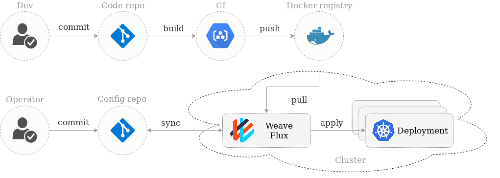
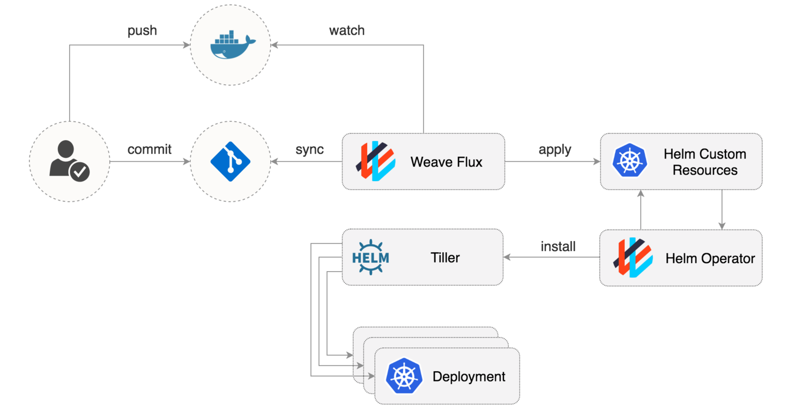
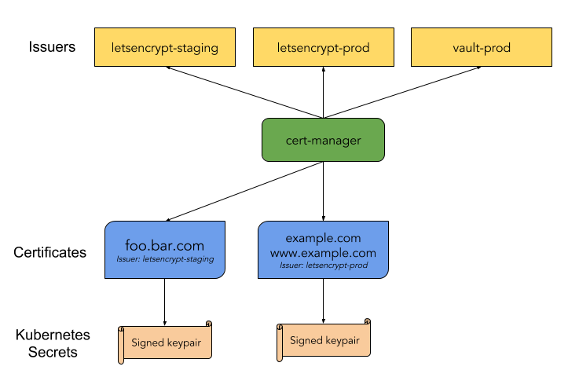

# Uke 6 - The mad girlfriend bug and GitOps

## Torsdag

I dag startet jeg endelig å jobbe med _Veien til Skyen_ prosjektet igjen. Konsulenten som har vært med meg tidligere kom i dag. I mens prosjektet har stått litt stille har jeg lest en del på fritiden om forskjellige teknologier og verktøy som hører hjemme i sky verdenen. Da kom jeg over ett konsept kalt GitOps, som stammer fra ordet DevOps.

::: tip GitOps

GitOps er en måte å gjøre kontinuerlig leveranse (CD). Det funger ved å bruke Git som sannhet for deklarativ infrastruktur og applikasjoner. Deklarativ programmering betyr å skrive kode for å beskrive **hva programmet skal gjøre** i motsetning til **hvordan det skal gjøre det**.

For eksempel: _det er 10 nginx-servere_, istedet for _start 10 nginx-servere, og fortell meg om det fungerte eller ikke_.

Men ideen går videre - ved hjelp av verktøy for å se på den faktiske tilstanden til produksjonen. Og dersom tilstanden i den virkelige verdenen ikke stemmer med kildekoden, vil du bli varslet slik at du får muligheten til å se forskjellene og fikse problemet.

Med andre ord GitOps utvider pipelinen med en feedback loop for observering og kontrollering av systemet.

:::

### Weaveworks Flux

[Weaveworks Flux](https://github.com/weaveworks/flux) er ett verktøy som implementerer GitOps metodikken. Flux blir kjørt inni Kubernetes klusteret og synkroniserer seg med konfigurasjons repository som vi hoster på Bitbucket. Når en ønsker å gjøre endringer i klusteret pusher utvikleren oppdateringene til repo'et og Flux vil lytte på endringer og utføre de. Det er lett å holde kontroll i git loggen hva Flux har gjort for den tagger, og commiter tilbake til repo'et.

Når en vanlig utvikler pusher kode til ett repo, så vil vår CI Pipeline i Bitbucket bygge og deploye docker imaget til Azure Container Registry. Da vil Flux laste ned docker imaget og utføre endringene mot klusteret, og oppdatere konfigurasjons repo'et.

Vi bruker i tillegg Helm for å kunne dra nytte av templates, package managment, test av distribusjoner og rollbacks osv. Da ser oversikten slik ut:

Dette fikk jeg testet og implementert i dag på _server_location_ modulen. Og det ser ut som dette kan være en utrolig god måte til å holde klusteret i sjakk. Bruker vi GitOps riktig vil det ikke være nødvendig å aksessere klusteret manuelt for å gjøre endringer. Dette minsker risikoen med at noen klusser til noe. Og at vi alltid har en plass som er sannheten og det er i repo'et.

### Jetstack Cert-Manager

Når vi skal kjøre tjenestene våre i skyen hos Azure på Kubernetes bør vi kryptere trafikken vår over HTTPS. Da trenger vi også TLS sertifikater.

::: tip Cert-Manager
[Cert-Manager](https://docs.cert-manager.io/en/latest/index.html) er en kraftig, allsidig sertifikatstyringskontroller for Kubernetes. Verktøyet vil skaffe sertifikaer, fra en rekke utstedere, og sørge for at disse er gyldige og oppdaterte. Og det vil kunne fornye sertifikater på en konfigurert tid før de utløper.
:::

Vi kommer til å bruke Let's Encrypt som en utsteder. Let's Encrypt er en gratis, automatisert og åpen sertifikatautoritet fra non-profit organisasjonen Internet Security Research Group (ISRG).

Liten oversikt over hvordan cert-manager virker:

Dette fikk jeg også konfigurert opp i dag og lagt inn i Helm Chartet til _dd_server_location_ modulen.

Alt i alt en veldig produktiv dag, men gjort mye research og for arbeid. Men etter flere dager med feilsøking i gammel Angular kode, var det gøy å gå over til dette prosjektet igjen.

I morgen fortsetter arbeidet videre med å trekke opp en ny modul i skyen. Denne krever en database tilkobling, så her må vi finne ut hvor i arkitekturen vi ønsker å plassere den.

## Mandag, tirsdag og onsdag

::: warning Mad girlfriend bug
When you see something strange is happening, but the software is telling you everything is fine.
:::

Har jobbet parallelt med flere oppgaver denne uken. I hovedsak har jeg jobbet med daglige oppgaver fra teamet mitt sin Kanban tavle, siden sky-prosjektet har en liten pause. Vi har nettopp tatt en _cut fra master_ som blir en leveranse til Eika. Denne har ett par saker som er blitt meldt inn fra kunden selv, og noen saker som testerne våre har meldt inn. På fredag fant jeg noen feil også, som jeg har jobbet med denne uken.

En sak jeg har sett på handlet om renderingen av en komponent i en av klientene som feilet når siden ble lastet i en ren nettleser. Med ren nettleser mener jeg at det ikke ligger noe cache som _localStorage_ og _sessionStorage_, samt ingen cookies.

Det har vært en frustrerende oppgave, for feilen ligger gjemt i klient koden. Alt på server siden var i orden. Til slutt var det flere på teamet som så på problemet. Til slutt viste det seg at kallene som gikk for å hente `i18n` tekstene som skal vises i klienten feilet, fordi de URL'en de gikk mot ikke var riktige. Dette resulterte i mange andre snodige feil, som gjorde at feilen så ut til å være noe den slett ikke skulle være.

Ellers har jeg hjupet en ny student som har begynt å jobbe hos oss med å sette opp noen API tester i Postman for å kjøre e2e-tester (ende til ende).

Også har jeg jobbet en del med en pipeline for JWT prosjektet, slik at ting blir bygget opp i Azure Artifacts.

I dag (Onsdag) fikk jeg endelig en prat med en av arkitektene som har vært med meg på _Veien mot skyene_ prosjektet, for å ta en status på hvordan prosjeket ligger an siden jeg skal fortsette med prosjektet fra i morgen av.
